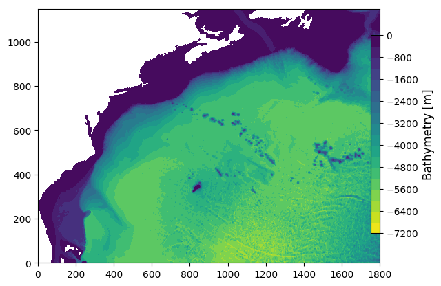

# SPECTRE


The objective of this proposal is to contribute to eddy parameterization by means of novel examinations of ensembles of ocean simulations.

To install, go to your preferred directoy (nothing heaving will be placed in there, this can be your /home/)

```$ cd /your/pref/dir/```

```$ git clone https://github.com/quentinjamet/SPECTRE ```

Go to the repo, then config directory:
```$ cd ./SPECTRE/MITgcm/```

Compile the code:
```$ ./Compile```

Go to run directory:
```$ cd ./memb000/```

Update the information on the slurm batch job ```run.sh```:
```#PBS -l walltime=00:59:00  -->> required run time```
```#PBS -M quentin.jamet@univ-grenoble-alpes.fr```


Run the code:
```$ qsub run.sh```

(To check the status of you job:
```qstat -u your_login```)

## Configuration



## Initial conditions, open boundaries and atmospheric forcing
Example of scripts to generate the model grid, the bathymetry, the surface and open boundary forcing as well as initial conditions are available in ```./mk_config/```.

- Initial conditions: The 48 members are initialized with the same initial conditions as those used to produce [CHAOCEAN](https://github.com/quentinjamet/chaocean), 1/12 North Atlantic ensemble simulations.

- Open boundary conditions: At the boundary of the domain, the ocean is forced by ocean state (T,S,U,V) inherited from [CHAOCEAN](https://github.com/quentinjamet/chaocean), 1/12 North Atlantic ensemble simulations.

- Atmospheric forcing: At the surface, the ocean model is coupled to the atmospheric boundary layer model CheapAML (Deremble et al, 2013). Atmospheric surface temperature and relative humidity respond to ocean surface structures by exchanges computed according to the COARE3 flux formula, but are strongly restored toward prescribed values over land. Other variables (downward longwave and solar shortwave radiation, precipitations) are prescribed everywhere. Atmospheric reanalysis products used in CheapAML originate from the Drakkar forcing set (DFS4.4, Brodeau et al, 2010; Dussin et al, 2016). Pricipitations are from DFS5.2 due to better time resolution. Atmospheric forcing are consistent with the previous, 1/12 North Altantic ensemble simulation [CHAOCEAN](https://github.com/quentinjamet/chaocean).


## Configuration files for MITgcm


## Simulations
Model ouptuts will be made available on request.

