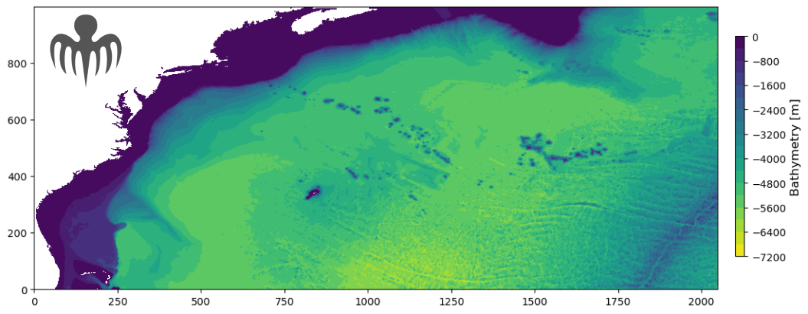

# SPECTRE


The objective of this proposal is to contribute to eddy parameterization by means of novel examinations of ensembles of ocean simulations.


## Configuration


[TBD: DESCRIPTION OF THE CONFIGURATION].
These 1/50 ensemble simulations are based on the earlier 1/12, 48-member ensemble simulation of the North Atlantic basin produced during the [CHAOCEAN](https://github.com/quentinjamet/chaocean) project.

These simulations are based on [MITgcm ](https://agupubs.onlinelibrary.wiley.com/doi/abs/10.1029/96JC02775).

Indications to help reproducing these simulations are provided in ```./SPECTRE/DOC/```.

## Initial conditions, open boundaries and atmospheric forcing
Example of scripts to generate the model grid, the bathymetry, the surface and open boundary forcing as well as initial conditions are available in ```./mk_config/```.

- Initial conditions: The 48 members are initialized with the same initial conditions as those used to produce [CHAOCEAN](https://github.com/quentinjamet/chaocean), 1/12 North Atlantic ensemble simulations.

- Open boundary conditions: At the boundary of the domain, the ocean is forced by ocean state (T,S,U,V) inherited from [CHAOCEAN](https://github.com/quentinjamet/chaocean), 1/12 North Atlantic ensemble simulations.

- Atmospheric forcing: At the surface, the ocean model is coupled to the atmospheric boundary layer model CheapAML ([Deremble et al, 2013](https://journals.ametsoc.org/view/journals/mwre/141/2/mwr-d-11-00254.1.xml)). Atmospheric surface temperature and relative humidity respond to ocean surface structures by exchanges computed according to the COARE3 flux formula, but are strongly restored toward prescribed values over land. Other variables (downward longwave and solar shortwave radiation, precipitations) are prescribed everywhere. Atmospheric reanalysis products used in CheapAML originate from the Drakkar forcing set (DFS4.4, [Brodeau et al, 2010](https://www.sciencedirect.com/science/article/abs/pii/S1463500309002017); [Dussin et al, 2016](https://www.drakkar-ocean.eu/publications/reports/dfs5-1-report)). Pricipitations are from DFS5.2 due to better time resolution. Atmospheric forcing are consistent with the previous, 1/12 North Altantic ensemble simulation [CHAOCEAN](https://github.com/quentinjamet/chaocean).

## Simulations outputs
Model ouptuts will be made available on request.

